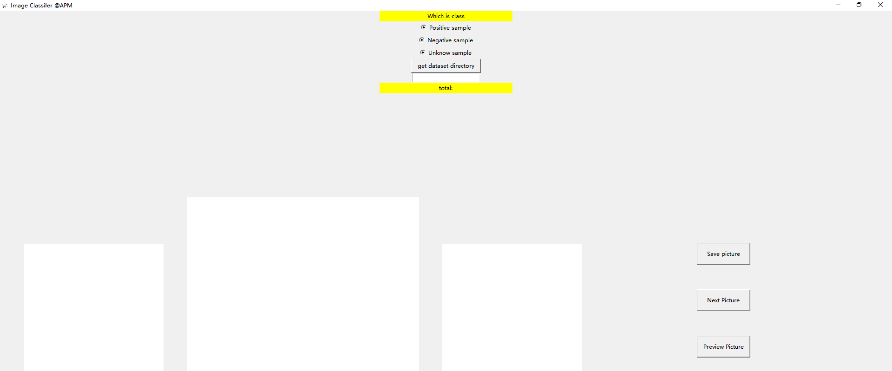
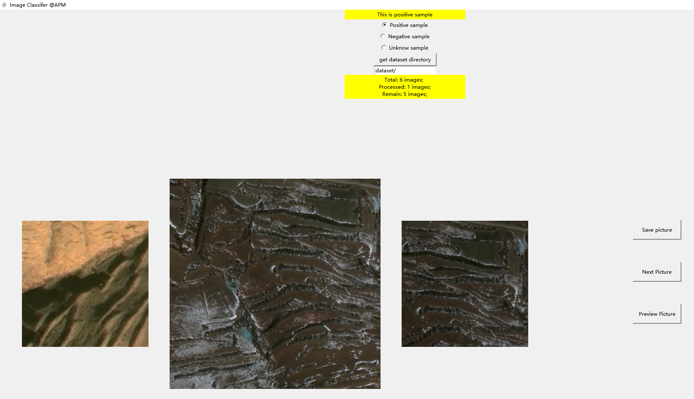
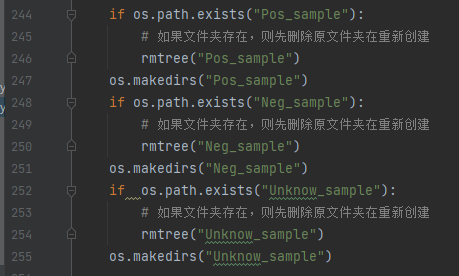
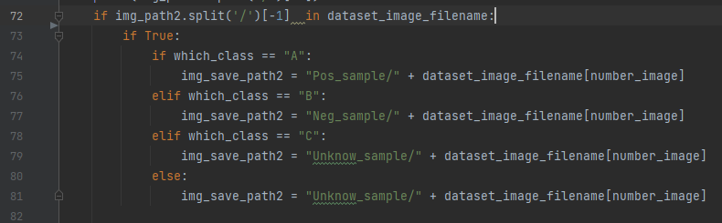

# ImageClassiferAssistant
This is a Image aid classification software based on python TK library development.

## Requirements

```shell
pip install tkinter pillow
```

## RUN

`python3 image_classifer_v1.1.py`


## GUI

* You will see this:



- Firstly, You can customize the input data set path by clicking Get dataset directory.

* Secondly, you can choose the picture which is class.
* Thirdly, you can save this sample to local.



Of course, you can also see the number of images remaining in the dataset and the total amount of data.


##   Attention

- Use the source code and data set in the same folder.
- When you run the code, three types of folders are automatically generated.
- If you forget which category the sample belongs to, the script automatically classifies it to Unknow_samople .






